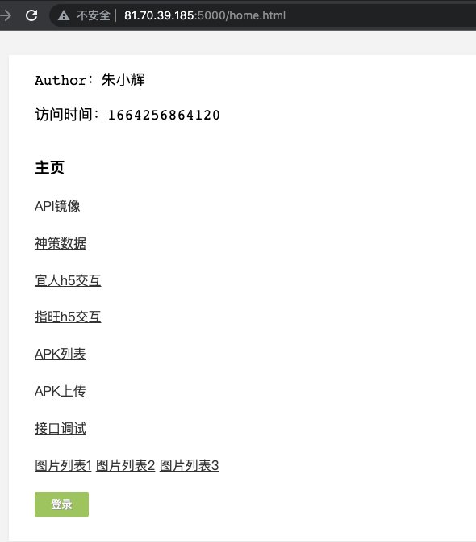
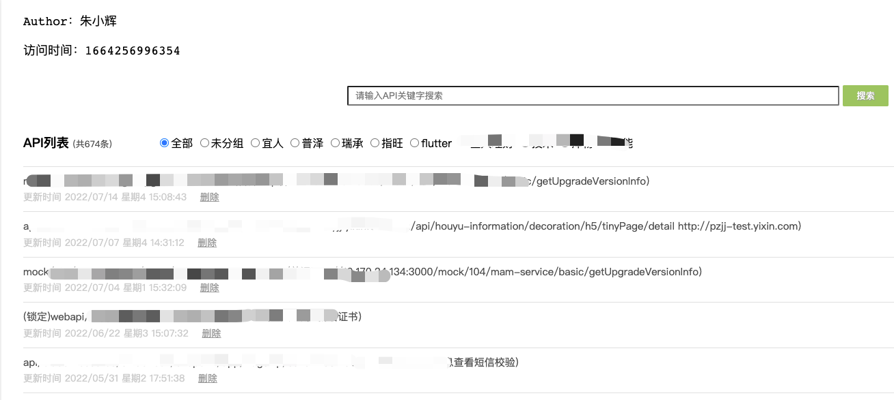

#### 一，客户端项目介绍见简书链接：
CNetSpy-HTTP网络监听与记录，API模拟（客户端）

https://www.jianshu.com/p/12995ed85a38

#### 二，服务端项目介绍见简书链接：
CFlaskProj-CNetSpy的API模拟（服务端）

https://www.jianshu.com/p/ff96b3612516

#### 三，H5端产品地址（自己临时买的腾讯云服务）：

http://81.70.39.185:5000/home.html



http://81.70.39.185:5000/mock/records.html


#### 项目初衷：
因产品频繁来问某个页面调用的哪个接口，虽然项目中已经集成了stetho可以方便我们在浏览器查看接口返回情况，但也需要把手机连上电脑，常常电脑还识别不了产品拿来的各种各样的手机，用自己的手机再重新打个同样的包，又得等个将近十分钟，干脆就自己开发一套项目一劳永逸地解决这个问题。

#### 项目引用：
```
implementation 'com.creditease:netspylib:4.8.5'
```
#### 项目介绍：
项目历经十几个版本，从只是记录接口返回，到现在已经逐步扩展到，接口数据镜像，异常记录与上传等实用功能。


对外开放的5个类：
NetSpyHelper和NetSpyInterceptor分别负责http监听记录及上传功能，
BugSpyHelper负责异常bug监听记录及上传，
ApiMockHelper和ApiMockInterceptor分别负责api镜像及展示功能。

##### 1，网络监听


默认开启通知，即当进行请求网络时，会展示网络结果通知，点击通知会进入网络监听主页面如下：


右上角三个按钮，分别为 搜索 上传 清空


搜索功能根据url path搜索并高亮显示，搜到的项目。


上传功能一键上传所有的url与参数，返回等信息。
```
class ApiRecordList(Resource):
    parser = reqparse.RequestParser()
    parser.add_argument('path')
    parser.add_argument('show_type')
    parser.add_argument('resp_data')
    parser.add_argument('resp_empty')
    parser.add_argument('resp_error')

    @staticmethod
    def get():
        return [x.json() for x in ApiRecordModel.query.order_by(ApiRecordModel.timestamp.desc()).all()]

    def post(self):
        args = self.parser.parse_args()
        path = args['path'].strip().lstrip('/').replace('/', '__')

        show_type = "" if args['show_type'] is None else args['show_type']
        resp_data = "" if args['resp_data'] is None else args['resp_data']
        resp_empty = "" if args['resp_empty'] is None else args['resp_empty']
        resp_error = "" if args['resp_error'] is None else args['resp_error']

        show_type = re.sub(r'\s+', '', show_type)
        resp_data = re.sub(r'\s+', '', resp_data)
        resp_empty = re.sub(r'\s+', '', resp_empty)
        resp_error = re.sub(r'\s+', '', resp_error)

        item = ApiRecordModel.find_by_path(path)
        if item is None:
            item = ApiRecordModel(path, show_type, resp_data, resp_empty, resp_error)
            item.save_to_db()
            return item.json(), 201
        else:
            if show_type in {"1", "0", "-1"}:
                item.show_type = show_type
            else:
                item.show_type = '1'

            if resp_data != '':
                item.resp_data = resp_data
            if resp_empty != '':
                item.resp_empty = resp_empty
            if resp_error != '':
                item.resp_error = resp_error
            item.timestamp = get_millisecond()
            ApiRecordModel.db_session_commit()
            return item.json()

    @staticmethod
    def get_paths():
        return [x.path for x in ApiRecordModel.query.order_by(ApiRecordModel.timestamp.desc()).all()]
```
上传时，如果数据中已经有path，则根据返回的值更新远程数据，否则新增数据
resp_data代表正常数据，resp_empty代码空数据，resp_error代码错误数据，具体详情可以参看我下篇文章关于 CFlaskProj的介绍。

NetSpyInterceptor这个类大致作用：

```
        if (!NetSpyHelper.isNetSpy) {//默认false 不拦截
            Request request = chain.request();
            return chain.proceed(request);
        }
```
默认不拦截，当设置为true时，请开始请求时，会把所有http相关数据保存到本地数据库中（这里用greenDao操作数据库），并发送一条通知。当数据请求返回时，会再次根据更新本地数据库，修改请求状态和返回。
```

    private long createHttpEvent(HttpEvent transaction) {
        transaction.setTransId(System.currentTimeMillis());
        DBHelper.getInstance().insertHttpData(transaction);
        if (showNotification) {
            notificationHelper.show(transaction);
        }
        return transaction.getTransId();
    }

    private long updateHttpEvent(HttpEvent transaction, long transId) {
        transaction.setTransId(transId);
        DBHelper.getInstance().insertHttpData(transaction);
        if (showNotification) {
            notificationHelper.show(transaction);
        }
        return transId;
    }
```

当点击item进入网络详情：


同样具有搜索功能，会高亮显示返回值的匹配的关键字，同时网络返回也是以json的格式展示，方便查看数据结构

##### 2，异常监听


##### 3，API模拟


这是所有网络接口展示


点击进入详情可以进行修改或新增


